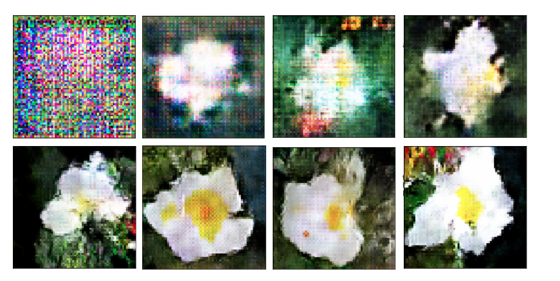
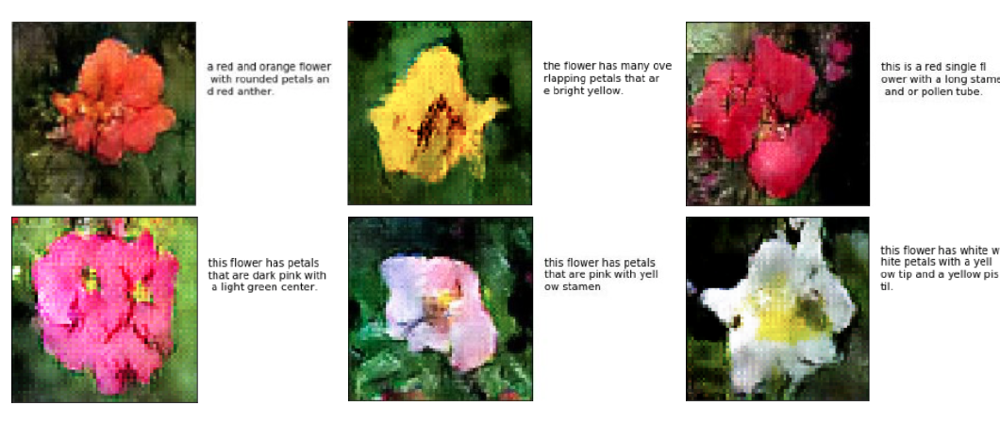
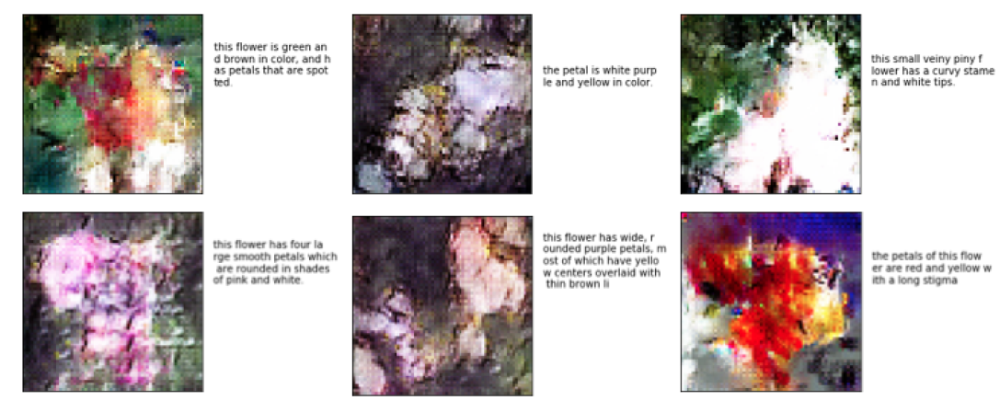

# text-to-image-GAN
Generative Adversarial Network (GAN) that learns to generate images given the text embeddings.
## Abstract
This is a replication of a part of a Neural Network Architecture proposed by [Reed et al.](https://arxiv.org/abs/1605.05396), which consists of a Text Embedding Network that translates detailed text descriptions into a text embedding; and a Generative Adversarial Network (GAN) that learns to generate images given the text embeddings. The goal is to generate plausible looking images that fit to the provided text descriptions. The dataset that is used here is called Oxford-102 Flowers dataset 1 that contains images of 150 classes of flowers and 10 text descriptions for every image. We only implement the GAN and not the Text Embedding Network, instead we use text embeddings for the flower dataset that are available. Our network learned to generates images that can be recognized as flowers and relate to the text description in a relatively good manner. We do not manage to produce images of the quality produced in the [original paper](https://arxiv.org/abs/1605.05396) although we trained our network more epochs then it was done in the original paper.

## Requirements
* python 3.5
* tensorflow 1.3

## Results
### Training process
This figure shows an exemplified training process for one class of flowers with the input caption: "This flower has petals that are white with yellow stamen". Epochs are approx: (1, 80, 300, 380, 820, 1350, 1520, 1710)

### Test data performance
This figure shows good results on the test set:

This figure shows bad results on the test set:

